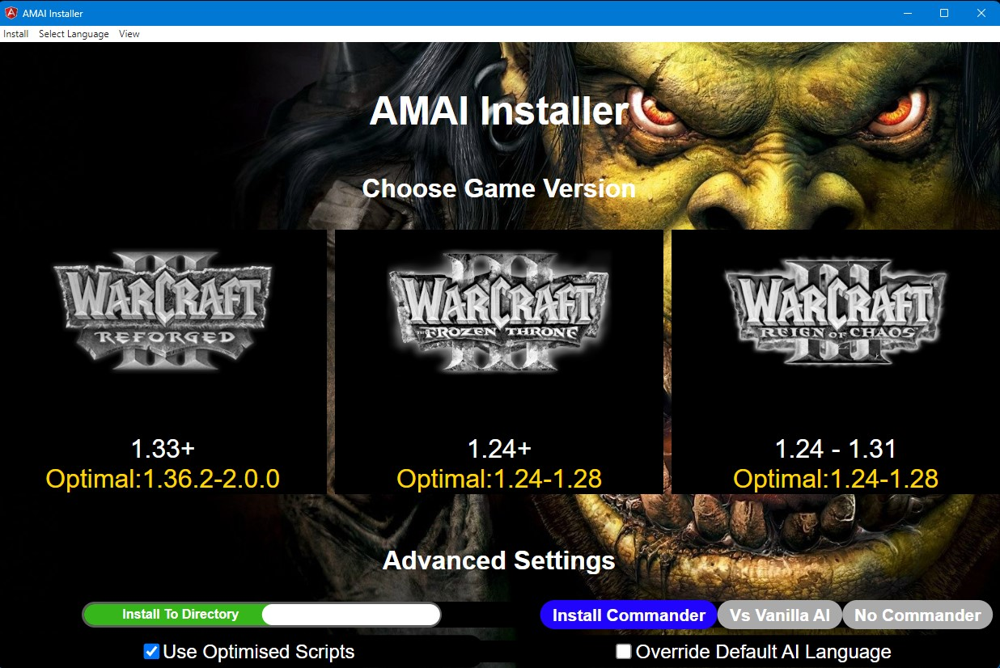
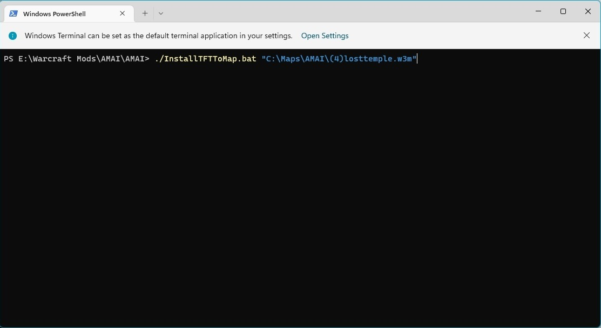

# 

Advanced Melee Artificial Intelligence Mod For Warcraft 3

Created by **AIAndy**, **Zalamander** and the **Strategy Master**.

Official Release Links available from: https://www.hiveworkshop.com/threads/advanced-melee-ai.62879/

As was originally hosted on http://www.wc3campaigns.net/forumdisplay.php?f=601

# How to Play
AMAI release comes with the standard AI scripts pre-built for you.

It is suggested to create a subfolder in your "maps" folder like `C:\Users\<username>\Documents\Warcraft III\Maps\AMAI` and copy the maps you intend to use AMAI with there.

You can opt to download a map pack containing a selection with AMAI preinstalled if you struggle to install or use an OS that is not supported. Or you can install onto your own maps with the below instructions.

For Warcraft 1.30 onwards you need to use http://www.zezula.net/en/casc/main.html to extract a copy of the official blizzard maps to install AMAI onto.

On windows make sure the maps to install onto are not in a protected UAC location. 
- This may mean you have to install to maps in a different directory then copy into your Maps folder afterwards 
- Or run installer as an administrator

## AMAI installer
- The installer has to be downloaded separately as its much larger compared to the AI package.
- Unzip the contents of the installer to a folder of your choice.
- Double-click amai-electron-manager.exe to open the installer.
- You can install to a single map or a whole directory.

## Warcraft Requirements and Versions
There are multiple editions of AMAI available to install based on your warcraft 3 version you run with. You must use the correct abrievation to install the correct scripts.
Improvements and fixes to the core AI engine will improve the older scripts as well.
- **REFORGED** : The AI scripts intended for the latest version of warcraft 3 **1.36+** (regardless if its **reforged** or not)
- **TFT** : The classic Frozen Throne AI scripts intended for TFT **1.24+** version of warcraft 3. Has some forwards compatability support up to **1.31** including 24 player support although tech tree changes in later versions will not be available to the AI.
- **ROC** : The classic Reign of Chaos AI scripts intended for ROC **1.24+** version of warcraft 3. Has some forwards compatability support up to **1.31** including 24 player support although tech tree changes in later versions will not be available to the AI.

* Avoid v1.29 of Warcraft 3 as it breaks various things and prevents AMAI from chatting. This is just an issue with this version and you can downgrade or upgrade.

## Commandline install
- From a windows commandline or powershell type `InstallREFORGEDToMap.bat "C:\mymap.w3m" 1` and press enter to install AMAI to maps
- If you do not want to have the Commander installed to control team mates or easily change language settings instead run `InstallREFORGEDToMap.bat "C:\mymap.w3m" 0`

- Alternatively for complex installs if you have `perl` installed from a commandline you can type `perl InstallToDir.pl REFORGED "C:\Documents\Warcraft III\Maps\AMAI"` and press enter to install AMAI to all maps in a directory and subdirectories.
- You can disable the commander for this install via the `perl InstallToDir.pl REFORGED "C:\Documents\Warcraft III\Maps\AMAI" "false"`
- After installing AMAI on your map just start Warcraft 3 and play the map against and/or with computers to make use of AMAI.
- For linux/Mac some have been able to use WINE to use the command line scripts to install.

## Manual install
- Especially for linux/Mac systems you can manually use the included `MPQEditor.exe` with WINE to install to a single map. 
- Copy contents of `Scripts/VER` folder to a `Scripts` directory in the map and the `Scripts/Blizzard.j` into the map under the same Scripts directory.

## Notes
- Advanced Melee AI is made to be used on 'melee' maps only so please don't try to use it on completly custom maps (e.g towerdefence), it will make no difference on such maps.
- Custom melee maps need to be set to latest patch data. Open the map in the Warcraft editor, go to Scenario->Map Options-> and change "Game Data Set" to "Melee (Latest Patch)".
- Lua maps do not appear to work. Open the map in the Warcraft editor, go to Scenario->Map Options-> and change "Script Language" to Jass, then install AMAI to it. If "Script Language" is disabled, please reset the "Trigger Editor" to its initial state.
- You may need to run as an administrator if you have issues with maps not displaying any teams.
- Note maps older than 1.24 will need resaving in the world editor for full 24 player support.

# Build Requirements
To build scripts from source code or to make custom changes you must install perl (via `strawberry` or `activestate`).
Additionally you need to install the *Tk* module if you want to run the **Strategy Manager UI Client** as described in the manual.
`Activestate` uses the package manager to install modules, while `strawberry` you need to use the CPAN client to install a module.

Tested with strawbery perl 5.30 and Tk 804.034

*You may need to run as an administrator if you have issues with maps not displaying any teams.

## Build Requirements for AMAI Installer (Via Electron)
- node 14 or greater...
- npm 6 or greater...
- angular-cli 16 or greater...

### Running electron locally:
- Go to the Electron folder inside the project and open the IDE of your choice.
- first run `npm i` to install project dependencies
- run `npm start` to open in development environment

### Deploying the Electron Installer:
- run `npm run electron:build` inside Electron folder
- You must have a built or downloaded copy of AMAI and unzip it in the folder `{your-amai-installer}/resources/AMAI`
  - You only need to include the `Scripts` folder and `MPQEditor.exe` within the AMAI directory.
- zip the contents of the release/win-unpacked folder and deploy this zipped file

### Notes about Electron Installer build process:
- I'm working on doing the zip mentioned above in an automated way.
- The build process creates the executable for the current operating system only. To create other executables, the process must be run on the corresponding operating system.
- I will be working on the possibility of building the linux executable on windows.

## Building Scripts
- You need to use the various `make` bat files to create the AI scripts for various versions.
- Run/double click *makeRFG.bat* to create the reforged scripts.
- Then install like normal e.g from a command prompt type *InstallREFORGEDToMap.bat "C:\mymap.w3m"* and press enter.
- To use the installer you must copy the `Scripts` folder and `MPQEditor.exe` to the folder `{your-amai-installer}/resources/AMAI`
- Run up a custom game and select the map to play.

## Optimise Build
- This will optimise previously built AI scripts to make them a little bit faster and leaner. Only useful if you are having performance issues.
- Not shipped by default.
- Run/double click one of the `makeOpt` bat files.
- Then install like normal.

## VS AI Build
- This special version that must be built to use, will make *odd* teams run with AMAI and *even* teams run with the standard blizzard AI.
- Useful for testing how much better AMAI is against the original AI.
- Not shipped by default as creates a very different blizzard.j file.
- Run/double click one of the `makeVAI` bat files e.g *makeVAITFT.bat* to create the AMAI vs AI scripts for the classic TFT version.
- Then install like normal e.g from a command prompt type *InstallTFTToMap.bat "C:\mymap.w3m"* and press enter.

# Features
- **Personality Profiles**: Each AI opponent has a set profile which modifies how it reacts or plays the game. Some can be real chickens and never dare to attack you while others will rush you down.
- **Dynamic Strategies**: Constantly monitors the current situation of the game and always try to pick the best suited strategy to counter the enemy forces.
  - The computers will pick from all strategies depending on what kind of units the enemy has, how long the game has been going and what favorite units the current profile has.
- **Enhanced Micromanagement Control**
  - To help keep as many units as possible alive by fleeing by town portal, zeppelin or foot.
  - This includes better use of items and healing items.
  - Makes the enemy force suffer as much as possible by focusing fire on the most vulnerable enemy units first if they are in range.
  - Will buy neutral heroes and units.
  - Can occasionally attempt tower rushes and militia/ancient expansions.
- **Enhanced Team Play**
  - Coordinates with allies what it will be attacking or will join allies in attacking a target.
  - Human players have access to the Commander, letting you give commands.
  - Asks for aid if running out resources.
- **Commander Game Modes**
  - Play matches where humans can only order their allies to victory with the `commander`, or humans and AMAI both directly control the same units and buildings.
- **Surrenders** : Based on profiles some AI's will give up when it detects its losing, while others will fight to the death.
- **Chat Support**
  - AMAI will taunt enemy players, and share its build strategy with team players.
  - Includes Support for **10 different languages**.
- Easy to use **Strategy and Profile editor**.
  - Supports an unlimited amount of your own profiles.
  - Supports an unlimited amount of your own strategies.
  - Auto Building feature for example: a AMAI computer only needs to know that it shall build a hero and 15 footmen. It will automatically build all needed buildings, workers and farms in order to get this as fast as possible.

# Commander
The Commander allows you to give orders to your ally AI's. 

There will also be language selection dialogs to change the language of dialogs and AI chat messages.

To *disable* the commander pass the correct option to the install scripts in the first place or run the `DisableCommander.bat "C:\mymap.w3m"` script afterwards.

You must disable the commander if you want to play on custom melee maps.

Once installed another dialog will appear with game mode options

1) No Commander - Disables the commander during this game
2) With Commander - Commander is availaable. Press 'ESC' to bring up the commander menu.
3) Computers Only - Same as commander except humans do not play, humans forces are removed and humans can only issue orders via the commander to try and make the ally ai win.
4) Joint Control - Same as 'Computers Only' but humans can also directly control their ally ai's forces.

## Commander Advanced Settings

It's now possible to set a default language and gametype so the dialog will not appear when game starts, instead the setting you made will apply at once.
To find the settings edit and search for "game_mode" in the Blizzard.j file located directly in the same folder as this readme file. You should directly end up viewing the two rows below.

    string language = ""  // Possible values: "" (dialog), "English", "Deutsch", "Swedish", "French", "Spanish", "Romanian", "Russian", "Portuguese", "Norwegian", "Chinese"
    string game_mode = "" // Possible values: "" (dialog), "commander", "no_human", "ai_only", "shared"

Now enter a setting you prefer in one or both of these rows, an example will follow.

If you make the first row look like this:
    string language = "English"  // Possible values: "" (dialog), "English", "Deutsch", "Swedish", "French", "Spanish", "Romanian", "Russian", "Portuguese", "Norwegian", "Chinese"

The language selection dialog will not show up again when the game starts, instead the specified language "English" will always be used by the computers.
The game_mode setting works exactly the same way but that setting will only apply if you play a game where different game modes are available like if you got an allied computer in the game, else the normal melee game type will always be used.

## Custom Maps
AMAI is designed to work with melee maps.

If you make a custom map you need to make sure in the world editor it is also set to Latest Patch dataset and still using the melee AI.
If you don't do this the AI will get stuck upgrading past tier 2 as it will use the vanilla patch.

Scripted maps may need to disable the Commander as it will otherwise conflict.

To change the patch data set use the following menus from the world editor.
> scenario -
> map properties -
> options -
> game data set -
> Change from Default (based on map melee status) to Latest Patch

If your custom map has custom units you will need to make custom changes to AMAI which can be followed in the `Manual`.

## Custom AI
AMAI has built in support to be able to write new strategies and profiles using the **Strategy Manager UI Client** . The `Manual` folder contains more details.

# Credits

### Helpers
- Hrothgaar
- WargH
- DK Slayer (For the Commander)

### Translations
- English - Chad Nicholas,
- Swedish - Zalamander,
- German - AIAndy, Sagan,
- French - JUJU, WILL THE ALMIGHTY,
- Spanish - Vexorian, Moyack,, Slayer95,
- Romanian - Andas_007,
- Chinese - Dr Fan, Sheeryiro, KeamSpring, Pixyy
- Russian - RaZ and Darkloke, Lolasik011,
- Portuguese - imba curisco ghouleh,
- Norwegian - Aray

### Quality Assurance
- Hrothgaar,
- WargH,
- ster,
- Tommi,
- xWOLF,
- Feannor,
- Jum-Jum,
- and anyone else missing a mention here.

### Tooling
- JASS Precompiler - Vidstige
- MPQEditor - Ladislav Zezula
